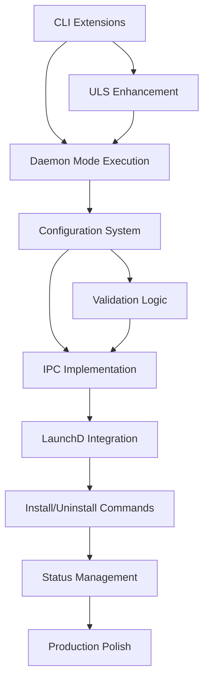

# Quickstart: LaunchD Daemon Implementation Guide

**Date**: September 20, 2025  
**Purpose**: Fast-track development guide for implementing daemon functionality

## Development Phases Overview

### Phase 1: Foundation (Days 1-2)
**Goal**: Basic daemon mode execution without launchd integration
- ✅ Extend CLI parsing for `--daemon` flag and subcommands
- ✅ Create daemon execution path (no terminal output, basic ULS logging)
- ✅ Implement configuration file parsing (TOML)
- ✅ Add basic IPC infrastructure (Unix domain socket)

### Phase 2: Configuration System (Days 3-4)  
**Goal**: Robust configuration management with validation
- ✅ Complete configuration validation and atomic updates
- ✅ Implement configuration diff and rollback mechanisms
- ✅ Add CLI commands for configuration management
- ✅ Test configuration persistence and reload

### Phase 3: LaunchD Integration (Days 5-6)
**Goal**: Full system integration via launchd
- ✅ Generate and install launchd plist files
- ✅ Implement install/uninstall commands with proper cleanup
- ✅ Add daemon status monitoring and control
- ✅ Test full installation lifecycle

### Phase 4: Production Readiness (Days 7-8)
**Goal**: Error handling, performance, and documentation
- ✅ Comprehensive error handling and recovery
- ✅ Performance optimization and monitoring
- ✅ Complete test suite (unit, integration, contract)
- ✅ Documentation and user guides

## Critical Path Dependencies



## Quick Implementation Checklist

### Day 1: CLI and Basic Daemon Mode

#### ✅ CLI Extensions (2-3 hours)
```rust
// Update src/cli/mod.rs
#[derive(Parser)]
pub struct Args {
    #[command(subcommand)]
    pub command: Option<Commands>,
    // ... existing fields
    #[arg(long)]
    pub daemon: bool,
}

#[derive(Subcommand)]
pub enum Commands {
    InstallDaemon { /* ... */ },
    UninstallDaemon,
    DaemonStatus,
    UpdateConfig { /* ... */ },
    Logs { /* ... */ },
}
```

#### ✅ Daemon Mode Execution (3-4 hours)
```rust
// Update src/main.rs
fn main() -> Result<()> {
    let args = Args::parse();
    
    match &args.command {
        Some(Commands::InstallDaemon { .. }) => daemon::install_daemon(),
        Some(Commands::DaemonStatus) => daemon::status(),
        // ... other commands
        None if args.daemon => daemon::run_daemon_mode(),
        None => run_scan_mode(),
    }
}

// Create src/daemon/mod.rs
pub mod config;
pub mod ipc;
pub mod launchd;
pub mod logging;

pub fn run_daemon_mode() -> Result<()> {
    // No terminal output, ULS logging only
    // Reuse existing monitor::polling logic
}
```

#### ✅ Basic Configuration (2 hours)
```rust
// Create src/daemon/config.rs
#[derive(Serialize, Deserialize)]
pub struct DaemonConfiguration {
    // Implementation from data-model.md
}

impl DaemonConfiguration {
    pub fn load_from_file(path: &Path) -> Result<Self>;
    pub fn save_to_file(&self, path: &Path) -> Result<()>;
    pub fn validate(&self) -> Result<()>;
}
```

### Day 2: Configuration and IPC Foundation

#### ✅ Configuration Validation (3-4 hours)
```rust
// Implement full validation from configuration-contract.md
pub fn validate_daemon_settings(settings: &DaemonSettings) -> Result<()>;
pub fn validate_monitoring_settings(settings: &MonitoringSettings) -> Result<()>;
pub fn validate_config_consistency(config: &DaemonConfiguration) -> Result<()>;
```

#### ✅ Basic IPC Infrastructure (4-5 hours)
```rust
// Create src/daemon/ipc.rs  
pub struct IpcServer {
    socket_path: PathBuf,
    listener: UnixListener,
}

impl IpcServer {
    pub async fn start(&self) -> Result<()>;
    pub async fn handle_connection(&self, stream: UnixStream) -> Result<()>;
}

#[derive(Serialize, Deserialize)]
pub enum IpcMessage {
    UpdateConfig { updates: ConfigUpdates },
    GetStatus,
    // ... from data-model.md
}
```

### Day 3: Advanced Configuration Features

#### ✅ Atomic Configuration Updates (4-5 hours)
```rust
// Implement atomic update process from configuration-contract.md
pub fn atomic_config_update(
    config_path: &Path,
    updates: ConfigUpdates,
) -> Result<DaemonConfiguration>;

// Backup and rollback functionality
pub fn create_config_backup(config_path: &Path) -> Result<PathBuf>;
pub fn rollback_config(config_path: &Path, backup_path: &Path) -> Result<()>;
```

#### ✅ CLI Configuration Commands (3-4 hours)
```rust
// Implement update-config command
pub fn handle_update_config(updates: Vec<String>) -> Result<()> {
    // Parse KEY=VALUE pairs
    // Validate updates
    // Apply atomically
    // Signal daemon via IPC
}
```

### Day 4: IPC and Communication

#### ✅ Full IPC Implementation (5-6 hours)
```rust
// Complete IPC message handling
pub async fn handle_ipc_message(message: IpcMessage) -> Result<IpcResponse>;

// Client-side IPC for CLI commands
pub fn send_ipc_request(message: IpcMessage) -> Result<IpcResponse>;

// Signal handling for configuration reload
pub fn setup_signal_handlers() -> Result<()>;
```

#### ✅ Configuration Reload Logic (2-3 hours)
```rust
// SIGHUP handler for configuration reload
pub fn reload_configuration(config_path: &Path) -> Result<()>;

// Hot-reload without daemon restart
pub fn apply_config_changes(
    old_config: &DaemonConfiguration,
    new_config: DaemonConfiguration,
) -> Result<()>;
```

### Day 5: LaunchD Integration

#### ✅ Plist Generation (3-4 hours)
```rust
// Create src/daemon/launchd.rs
pub fn generate_plist(daemon_path: &Path) -> Result<String> {
    // XML plist generation
    // System vs user daemon options
    // Security and permission settings
}

pub fn install_plist(plist_content: &str, service_name: &str) -> Result<()>;
pub fn uninstall_plist(service_name: &str) -> Result<()>;
```

#### ✅ LaunchD Commands (4-5 hours)
```rust
// launchctl integration
pub fn launchctl_load(plist_path: &Path) -> Result<()>;
pub fn launchctl_unload(service_name: &str) -> Result<()>;
pub fn launchctl_start(service_name: &str) -> Result<()>;
pub fn launchctl_stop(service_name: &str) -> Result<()>;
pub fn launchctl_list(service_name: &str) -> Result<LaunchDStatus>;
```

### Day 6: Installation Commands

#### ✅ Install/Uninstall Commands (5-6 hours)
```rust
// Implement install-daemon command
pub fn install_daemon(config_path: Option<PathBuf>) -> Result<()> {
    // Check privileges
    // Generate configuration
    // Create directory structure
    // Install plist
    // Start service
    // Verify installation
}

// Implement uninstall-daemon command  
pub fn uninstall_daemon(force: bool) -> Result<()> {
    // Stop service
    // Unload plist
    // Remove files
    // Clean up directories
    // Verify removal
}
```

#### ✅ Status and Control Commands (2-3 hours)
```rust
// Implement daemon-status command
pub fn daemon_status(json: bool, verbose: bool) -> Result<()>;

// Control operations (start/stop/restart)
pub fn control_daemon(operation: ControlOperation) -> Result<()>;
```

### Day 7: Polish and Error Handling

#### ✅ Enhanced Error Handling (4-5 hours)
```rust
// Comprehensive error types
#[derive(Error, Debug)]
pub enum DaemonError {
    #[error("Configuration error: {0}")]
    Configuration(#[from] ConfigError),
    
    #[error("LaunchD operation failed: {operation}: {error}")]
    LaunchD { operation: String, error: String },
    
    // ... other error types
}

// Error recovery and fallback strategies
pub fn handle_daemon_error(error: DaemonError) -> Result<()>;
```

#### ✅ Performance Optimization (3-4 hours)
```rust
// Memory usage monitoring
pub fn monitor_memory_usage() -> MemoryStats;

// Performance metrics collection
pub fn collect_performance_metrics() -> PerformanceStats;

// Optimization: reduce allocations, efficient polling
```

### Day 8: Testing and Documentation

#### ✅ Comprehensive Test Suite (5-6 hours)
```rust
// Contract tests for all CLI commands
#[test]
fn test_install_daemon_cli();

#[test]  
fn test_configuration_validation();

#[test]
fn test_ipc_communication();

// Integration tests for full workflows
#[test]
fn test_full_installation_lifecycle();
```

#### ✅ Documentation Updates (2-3 hours)
- Update README with daemon installation instructions
- Add troubleshooting guide
- Document configuration options
- Create user migration guide

## Key Implementation Notes

### Critical Design Decisions

#### 1. Async vs Sync Runtime
**Decision**: Use tokio for daemon mode only
**Rationale**: IPC and signal handling benefit from async, but CLI operations remain synchronous
```rust
// Conditional async runtime
#[cfg(feature = "daemon")]
#[tokio::main]
async fn run_daemon_mode() -> Result<()> { /* ... */ }

// Regular CLI remains synchronous
fn main() -> Result<()> {
    if args.daemon {
        #[cfg(feature = "daemon")]
        return run_daemon_mode();
    }
    run_scan_mode()  // Synchronous
}
```

#### 2. Configuration Management Strategy
**Decision**: Atomic file updates with validation
**Rationale**: Prevents corrupted state, allows rollback
```rust
// Atomic update pattern
pub fn atomic_config_update(path: &Path, new_config: &DaemonConfiguration) -> Result<()> {
    let temp_path = path.with_extension("tmp");
    let backup_path = create_backup(path)?;
    
    // Write → Validate → Replace → Cleanup
    write_config(&temp_path, new_config)?;
    validate_config_file(&temp_path)?;
    fs::rename(&temp_path, path)?;
    Ok(())
}
```

#### 3. Privilege Management
**Decision**: Minimal privilege escalation
**Rationale**: Security best practices, user trust
```rust
// Check privileges early
pub fn ensure_required_privileges(operation: &str) -> Result<()> {
    if !is_root() && requires_root(operation) {
        return Err(DaemonError::InsufficientPrivileges {
            operation: operation.to_string(),
            required: "root".to_string(),
            suggestion: format!("Run: sudo listent {}", operation),
        });
    }
    Ok(())
}
```

### Performance Targets
- **Daemon startup**: <2 seconds to operational
- **Configuration update**: <100ms end-to-end
- **Memory usage**: <20MB resident (daemon mode)
- **IPC latency**: <10ms for status queries
- **CLI startup**: Maintain <50ms (constitutional requirement)

### Risk Mitigation
1. **LaunchD complexity**: Extensive testing, Apple documentation adherence
2. **Configuration corruption**: Atomic updates, automatic backup/restore
3. **IPC reliability**: Connection timeout, automatic retry, graceful degradation
4. **Permission issues**: Clear error messages, privilege checking, user guidance

## Testing Strategy

### Unit Tests (Per Phase)
- Configuration parsing and validation
- IPC message serialization/deserialization  
- LaunchD plist generation
- Error handling scenarios

### Integration Tests (End of Each Phase)
- CLI command end-to-end workflows
- Configuration update and reload cycles
- Daemon installation and management
- Cross-system compatibility (Intel/Apple Silicon)

### Contract Tests (Final Phase)
- All CLI interfaces match specifications
- Configuration format compliance
- ULS logging format consistency
- Performance requirement validation

This quickstart guide provides a clear roadmap for efficient implementation while maintaining quality and meeting all specified requirements.